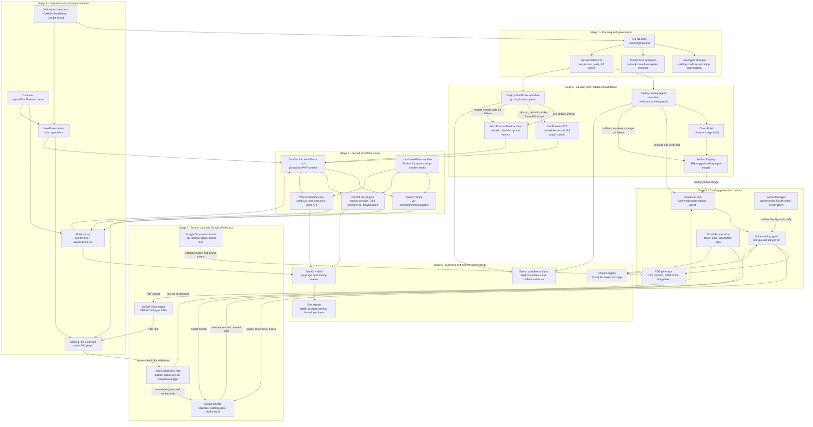

# MyBroworld

MyBroworld is the operating workspace for the Lucia Astuy online shop and catalog PDF system. It keeps the customer-facing WordPress/WooCommerce custom layer, the Google Sheets catalog workflow, the PDF generator, and the production deployment automation in one repository.

The production goal is that the customer can run the shop and generate catalogs from her WordPress and Google accounts, without depending on this workstation.

## System Map

This diagram keeps the system at operating level: logical layers, production runtime, infrastructure boundaries, observability, and delivery stages. Detailed runbooks live in the linked docs below.

## Stage Summary

| Stage | Main components | Purpose | Current state |
| --- | --- | --- | --- |
| Customer operation | WordPress, WooCommerce | Run the shop and request catalog PDFs | Live; customer-account validation still pending |
| Queue and source data | Apps Script, Google Sheets | Store catalog source rows, queued jobs, status, and review state | Live |
| PDF runtime | Apps Script, Cloud Run, Secret Manager, Google Drive | Render catalogs in Google Cloud as `mybrocorp@gmail.com` only when an operator requests a PDF | Live and manually deploy-validated; PDFs write to `OBRA/Catalogos` |
| Monitoring | Cloud Run monitor, Cloud Logging | Detect failed, stale, or incomplete jobs | Live |
| Catalog-agent delivery | GitHub Actions, Cloud Build, Artifact Registry | Validate, build, deploy, verify, and roll back the catalog worker | Configured and manually validated; auto-deploy disabled |
| WordPress delivery | GitHub Actions, DonDominio FTP | Deploy owned theme and MU plugin changes | Manually validated with rollback archive/restore; auto-deploy disabled |

## Current Gates

- Customer handoff gate: one catalog still needs to be queued, completed, opened, and reviewed from the customer's mybro WordPress account.
- Catalog image gate: strict `_cat` image selection should stay disabled until the shared Drive image folder contains exactly one `_cat` image per included, catalog-ready artwork.
- WordPress CD gate: reviewed manual workflow run `25509617424` validated the pre-deploy archive, rollback restore path, deploy, and production smoke checks on 2026-05-07; unattended WordPress deploys remain disabled.
- Auto-deploy gate: `ENABLE_CATALOG_AGENT_AUTO_DEPLOY` and `ENABLE_WORDPRESS_AUTO_DEPLOY` remain unset until manual validation is complete.
- Source-sync gate: WooCommerce auto-apply remains disabled until source readiness monitoring and repeated safe dry-runs are proven.

## Key References

- Project status: [PROJECT_STATUS.md](PROJECT_STATUS.md)
- Production deployments: [thoughts/shared/docs/deployments.md](thoughts/shared/docs/deployments.md)
- Customer testing and handoff: [thoughts/shared/docs/customer-testing-and-handoff.md](thoughts/shared/docs/customer-testing-and-handoff.md)
- Catalog generator: [catalog-generator/README.md](catalog-generator/README.md)
- Cloud Run catalog worker: [catalog-generator/cloud-run/README.md](catalog-generator/cloud-run/README.md)
- WordPress workspace: [wordpress/README.md](wordpress/README.md)
